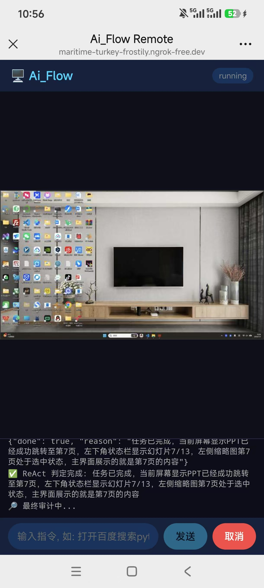
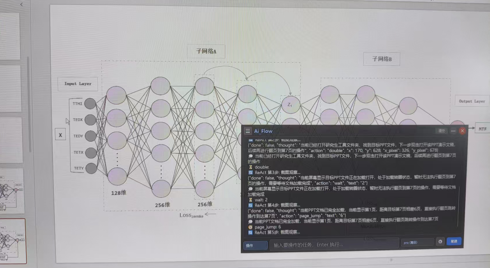

<p align="center">
  
</p>

<h2 align="center">Ai_Flow — 智能远程桌面AI助手</h2>

<p align="center">
  <b>截图+AI 流式对话 · ReAct 桌面自动化 · 手机远程控制 · 长期记忆 · 隐私保护</b>
</p>

---

## 这是什么

Ai_Flow 是一个 Windows 桌面常驻悬浮窗。按下快捷键截取屏幕任意区域，豆包多模态大模型流式解析。也可以直接在输入框打字对话。

内置 **ReAct GUI Agent**——纯视觉决策引擎，AI 看截图自己决定下一步该点哪里、敲什么。输入自然语言即可自动操作桌面和浏览器：打开软件、搜索网页、填写表单、点击按钮，完全模拟人类操作。

支持**手机远程控制**，手机浏览器扫码即可实时查看 PC 屏幕并发送指令。**多层记忆系统**让 AI 记住你是谁、你在做什么项目、你的偏好。**MCP 浏览器自动化**让你操控浏览器像操控本地应用一样自然。

- **纯文本对话** — 悬浮窗底部输入框打字，Enter 发送
- **截图提问** — `Ctrl+D` 连续截图，缩略图累积，点发送统一提交
- **OCR 识别** — `Ctrl+R` 截图，腾讯云 OCR 识别返回可复制文字
- **桌面自动化** — `Ctrl+G` 或输入 `自动 任务`，ReAct Agent 自动操作桌面/浏览器
- **手机远程控制** — 手机浏览器扫码，实时看截图+发指令+控制 PC
- **浏览器自动化** — Playwright MCP Server + CDP 双引擎，自动打开网页操作
- **语音输入** — `Ctrl+Y` 实时语音转文字，滚轮选句子，AI问答

## 操作演示

悬浮窗常驻桌面，底部随时打字。`Ctrl+F` 隐藏/显示。


`Ctrl+D` 进入截图，拖拽松手自动确认变绿，连续多框。`Ctrl+Z` 撤销。


框选完 Enter 放入对话框，缩略图累积，可删除单张。输入文字点发送。


**GUI Agent 桌面自动化** — AI 看截图自己决定每一步操作。



**手机远程控制** — 手机浏览器扫码，实时看 PC 屏幕 + 发送指令。



## 快捷键

| 快捷键 | 功能 |
|--------|------|
| `Ctrl+D` | 截图发送（支持多框连续截图） |
| `Ctrl+R` | OCR 文字识别 |
| `Ctrl+G` | GUI Agent 桌面自动化弹窗 |
| `Ctrl+Y` | 语音识别（实时录音，静默自动断句） |
| `Ctrl+F` | 隐藏/显示悬浮窗 |
| `ESC` | 终止当前 GUI Agent 操作 |
| `Ctrl+Q` | 退出程序 |

## 功能一览

| 分类 | 功能 | 说明 |
|------|------|------|
| **截图对话** | 常驻悬浮窗 | 启动即显示，可拖拽移动、四角缩放、半透明置顶 |
| | 连续截图 | 松手自动确认变绿，多框多图同时提交，`Ctrl+Z` 撤销 |
| | 缩略图预览 | 截图累积显示在输入框上方，可单独删除 |
| **AI 引擎** | 多模态理解 | 豆包 VL，支持多图 + 文字混合输入，最懂中文 |
| | 流式输出 | 逐字显示，Markdown 渲染（表格 / 代码块 / 标题 / 粗斜体 / 列表） |
| | 模型切换 | mini / lite / pro 三档随时切换，省成本或追求质量 |
| | 三层记忆 | 短期最近 3 轮原文 + 中期会话历史 BM25 检索 + 长期跨越会话的用户画像 |
| **GUI 自动化** | ReAct 循环 | 截图 → AI 看图思考 → 返回动作坐标 → pyautogui 执行 → 再看效果 |
| | 纯视觉定位 | 模型直接看截图返回归一化坐标 (0-1000)，无需 DOM/无障碍 API |
| | 15 步循环 | 每步 1.5s 间隔，最多 15 轮，连续 3 次相同动作自动退出防死循环 |
| | 安全性 | ESC 立即终止、`Alt+F4` 等关闭快捷键智能拦截 |
| | 最终审计 | 完成后用 pro 模型独立判定任务成功/失败 |
| **浏览器自动化** | MCP 协议 | Playwright MCP Server，JSON-RPC 2.0 over stdio，自动发现工具 |
| | CDP 兜底 | MCP 不可用时自动启动 Edge/Chrome 通过 DevTools Protocol 直连 |
| | 三层兜底 | MCP → CDP → `Win+R` 手打网址，保证浏览器总能打开 |
| | 懒连接 | 直到 AI 第一次需要 open_url 才启动浏览器，零开销 |
| **手机远程** | 实时截图 | 每 1.5s 自动推送，降采样 720px + JPEG 50% 省流量 |
| | 多轮任务 | 子进程常驻模式，手机连续发指令不复启动 |
| | 多种穿透 | 局域网 IP + Tailscale + ngrok + Cloudflare Tunnel，自动生成二维码 |
| **记忆系统** | 短期记忆 | 最近 3 轮对话原文，直接拼入 prompt |
| | 中期记忆 | 超出 3 轮的消息索引进 BM25 向量库，语义搜索 Top-K 注入上下文 |
| | 长期记忆 | 对话结束后 AI 自动提炼用户事实，FAISS 语义检索 + 关键词回退 |
| | 检索精排 | RRF 双路融合 + lightweight rerank 精排 |
| **语音 & OCR** | 语音输入 | PyAudio 实时录音 + 腾讯云 ASR，静默 0.8s 自动断句，滚轮选句子 |
| | OCR 识别 | 腾讯云 GeneralBasicOCR，1000 次/月免费，批量多区域识别 |
| **隐私 & 设置** | 隐私保护 | `SetWindowDisplayAffinity(0x11)` 防屏幕捕获，截图/录屏/会议看不到悬浮窗 |
| | 即时设置 | 悬浮窗底部按钮，随时配置 API Key / 代理 / OCR 凭证 |
| | 系统托盘 | 最小化到托盘，右键菜单操作，气泡提示 |
| | 对话管理 | 侧边栏切换/搜索/重命名/删除对话，多用户按 API Key 隔离 |

## GUI Agent 桌面自动化

输入框输入 `自动 你的任务` 或用 `Ctrl+G` 打开任务面板，AI 自动操作桌面。

### 使用示例

```
自动 打开百度搜索 Python，然后点进一个网页
自动 打开浏览器进入 B 站搜周杰伦
自动 打开计算器算 123+456
自动 帮我在桌面上新建一个文件夹命名为 test
自动 打开记事本写一段代码
```

### ReAct 工作流程

```
ReAct Loop (最多 15 步):
  ① 截图全桌面
  ② 发送给豆包 VL → AI 看图思考
  ③ AI 返回: {"done": false, "thought": "看到百度首页...",
               "action": "click", "x": 500, "y": 300}
  ④ 归一化坐标 0-1000 → 像素坐标
  ⑤ pyautogui / MCP 执行动作
  ⑥ sleep 1.5s 等待页面响应
  ⑦ 截图看效果 → 下一步
  ... 循环 ...
  AI 判定完成 → {"done": true, "reason": "已成功打开目标网页"}
  ↓
最终审计 — pro 模型独立验证
```

### 核心设计

| 特性 | 说明 |
|------|------|
| **纯视觉定位** | 模型直接看截图返回归一化坐标 (0-1000)，`pixel = normalized * img_dim / 1000` |
| **ReAct 范式** | 每步观察→思考→行动，AI 动态决策，不依赖预定义步骤 |
| **9 种动作** | click / double / right / move / drag / fill / hotkey / scroll / wait |
| **安全机制** | ESC 立即终止、最大 15 步、连续 3 次相同动作自动退出、`Alt+F4` 智能拦截 |
| **进程隔离** | Agent 跑在独立子进程，崩溃不影响 UI，方便取消和资源回收 |

## 手机远程控制

手机浏览器扫码或输入 URL，实时查看 PC 屏幕、发送指令、控制 PC 执行任务。


### 连接方式

| 场景 | 做法 | 手机打开 |
|------|------|----------|
| 同 WiFi | 手机和 PC 同一 WiFi | `http://192.168.1.x:8765` |
| 手机热点 | 手机开热点 → PC 连接 | 同上（局域网 IP 不变） |
| Tailscale | 两台设备装 Tailscale | `http://100.x.x.x:8765` |
| Cloudflare Tunnel | 自动获取公网 URL | `https://xxx.trycloudflare.com` |

### 功能

- 📸 **实时截图** — 每 1.5 秒自动推送，降采样 720px + JPEG 50% 省流量
- 📝 **发送指令** — 输入自然语言任务，和 PC 端 "自动 xxx" 完全一样
- 🛑 **远程取消** — 点取消按钮 = PC 按 ESC
- 📊 **进度日志** — 实时显示 ReAct 每一步的执行状态
- 🔄 **多轮复用** — 子进程保持不退出，连续发指令无需重新初始化浏览器

## 快速上手

### 环境要求

- Windows 10/11
- Python 3.10+
- Node.js（可选，浏览器自动化需要 `npx`）

### 安装

```bash
git clone https://github.com/zebinlu7-a11y/screen-flow-ai-agent.git
cd screen-flow-ai-agent
pip install -r requirements.txt
```

### 配置

启动后点悬浮窗底部设置按钮（⚙️），填写：

| 配置项 | 获取地址 | 必填 |
|--------|----------|------|
| API Key | [console.volcengine.com/ark](https://console.volcengine.com/ark/region:ark+cn-beijing/apiKey) | ✅ |
| 代理地址 | 如 `http://127.0.0.1:7897`，不需要则留空 | ❌ |
| OCR SecretId/Key | [console.cloud.tencent.com/cam/capi](https://console.cloud.tencent.com/cam/capi) | ❌ |

### 启动

```bash
python main.py
```

启动后系统托盘出现图标，悬浮窗自动显示。按 `Ctrl+D` 开始截图，或在悬浮窗底部直接打字对话。

## 下载

pyinstaller打包压缩成ZIP，解压双击 `Ai_Flow.exe` 运行。

## 架构

```
┌──────────────────────────────────────────────────────────────┐
│  main.py                        Qt 主进程 + 悬浮窗              │
│  ├─ 对话:   StreamWorker → LangGraph → 豆包 VL 流式输出        │
│  ├─ 自动化: DesktopAgentProcessThread → 子进程 → ReAct Agent  │
│  └─ 远程:   RemoteServer → HTTP API → 手机浏览器控制           │
├──────────────────────────────────────────────────────────────┤
│  agent/                          AI 核心                       │
│  ├─ gui_agent.py       ReAct Agent + MCP 浏览器 + Loop Engineer│
│  ├─ graph.py           LangGraph 状态机 + 三层记忆检索         │
│  ├─ llm_client.py      豆包 VL ChatModel (OpenAI-compatible)  │
│  ├─ state.py           AgentState 类型定义                     │
│  └─ run_gui_agent.py   自动化子进程 CLI 入口                   │
├──────────────────────────────────────────────────────────────┤
│  gui/                Qt 界面        │  utils/          工具库   │
│  ├─ capture_window.py 截图遮罩      │  ├─ image_tool.py   图片  │
│  ├─ result_window.py  悬浮窗        │  ├─ ocr_tool.py     OCR   │
│  ├─ sidebar_widget.py  侧边栏       │  ├─ speech_worker.py 语音  │
│  ├─ api_key_dialog.py  设置弹窗     │  ├─ memory_store.py 记忆  │
│  ├─ gui_agent_panel.py 任务面板     │  ├─ vector_store.py FAISS │
│  └─ input_widget.py   快捷输入      │  ├─ retrieval_ranker.py  │
│                                      │  ├─ context_store.py    │
│  remote/             手机远程        │  ├─ user_manager.py     │
│  ├─ server.py        HTTP API       │  ├─ api_key_manager.py  │
│  └─ phone.html       手机界面       │  └─ token_counter.py    │
└──────────────────────────────────────────────────────────────┘
```

## 项目结构

```text
AIRAG/
├── main.py                     # Qt 主入口: 悬浮窗 + 热键 + 子进程管理 + 远程服务
├── config.py                   # 全局配置 (API Key / 模型 / 代理 / MCP / 端口)
├── build_exe.py                # PyInstaller 打包脚本
├── requirements.txt            # Python 依赖
│
├── agent/                      # AI Agent 核心
│   ├── state.py                # LangGraph AgentState 类型定义
│   ├── graph.py                # LangGraph 状态机 + 流式对话 + 三层记忆检索
│   ├── llm_client.py           # 豆包 VL ChatModel (OpenAI-compatible 封装)
│   ├── gui_agent.py            # 🖥️ ReAct GUI Agent + MCP 客户端 + CDP 兜底
│   └── run_gui_agent.py        # GUI Agent 独立子进程 CLI 入口
│
├── gui/                        # Qt 界面
│   ├── capture_window.py       # 全屏截图遮罩 (多框拖拽 + Ctrl+Z + 锚点调整)
│   ├── result_window.py        # 悬浮窗 (Markdown + 流式 + 侧边栏 + 隐私模式)
│   ├── sidebar_widget.py       # 对话历史侧边栏 (搜索/新建/删除/重命名)
│   ├── api_key_dialog.py       # 设置弹窗 (API Key / 代理 / OCR 凭证)
│   ├── gui_agent_panel.py      # GUI Agent 任务面板 (进度条 + 状态)
│   └── input_widget.py         # 截图后快捷输入弹窗
│
├── remote/                     # 手机远程控制
│   ├── server.py               # HTTP API 服务 (aiohttp) + Cloudflare Tunnel + QR 码
│   └── phone.html              # 手机端界面 (深色主题, 响应式, 轮询截图)
│
├── utils/                      # 工具库
│   ├── image_tool.py           # QImage ↔ PIL ↔ base64 转换 + 压缩
│   ├── ocr_tool.py             # 腾讯云 OCR 封装
│   ├── token_counter.py        # Token 估算 (中文/英文/图片)
│   ├── context_store.py        # LangChain 消息持久化
│   ├── api_key_manager.py      # airag_config.json 本地配置读写
│   ├── user_manager.py         # 多用户隔离 + 对话 CRUD
│   ├── speech_worker.py        # PyAudio 录音 + 腾讯云 ASR (音量检测断句)
│   ├── memory_store.py         # 长期记忆提取/去重/检索/注入 prompt
│   ├── vector_store.py         # FAISS + TF-IDF 向量存储引擎
│   ├── retrieval_ranker.py     # RRF 融合 + lightweight rerank 精排
│   ├── gui_operation_memory.py # GUI 操作历史记忆
│   └── session_memory.py       # 会话记忆管理
│
└── assets/                     # 截图和图标
    ├── logo.png
    ├── user.png / user1.png / user2.png / user3.png
    ├── user5.png               # 手机远程控制界面
    └── user6.jpg               # GUI Agent 桌面自动化
```

## 技术栈

| 层次 | 技术 |
|------|------|
| UI | PyQt6，无边框悬浮窗，系统托盘，Markdown 渲染 |
| 热键 | pynput GlobalHotKeys，后台线程监听，`QTimer.singleShot` 切主线程 |
| Agent 范式 | **ReAct** (Reasoning + Acting) 纯视觉循环 + Loop Engineer 外层控制 |
| 决策模型 | 豆包 VL lite（ReAct 决策），豆包 VL pro（最终审计） |
| LLM | 豆包 VL（火山引擎方舟），OpenAI-compatible API |
| 流式输出 | LangChain BaseChatModel，SSE streaming，QThread + asyncio |
| 状态机 | **LangGraph** StateGraph + MemorySaver 检查点 |
| 浏览器控制 | **MCP** (Model Context Protocol) JSON-RPC 2.0 over stdio + Playwright CDP 兜底 |
| 桌面操作 | pyautogui（鼠标/键盘），pyperclip（剪贴板粘贴） |
| 记忆检索 | BM25 + 关键词双路召回 → RRF 融合 → lightweight rerank 精排 |
| 向量存储 | FAISS IndexFlatIP + TF-IDF + jieba 分词 |
| 长期记忆 | LLM 后台提取事实 → Jaccard 去重 → FAISS 索引 → 注入 prompt |
| 远程控制 | aiohttp HTTP API + 轮询 + Cloudflare Tunnel / ngrok / Tailscale |
| 语音识别 | PyAudio 实时录音 + 腾讯云 ASR，VAD 音量阈值断句 |
| OCR | 腾讯云 GeneralBasicOCR，1000 次/月免费额度 |
| 打包 | PyInstaller onedir 模式 |

## 并发架构

```
1 个主进程 ─┬─ 主线程 (Qt QEventLoop)     UI 渲染 + 热键响应 + 定时器
            ├─ QThread: StreamWorker       asyncio 协程 → 流式对话
            ├─ QThread: DesktopAgentThread  stdout 管道 → 管理子进程
            ├─ QThread: MemWorker          同步阻塞 → 长期记忆提取
            └─ 守护线程: RemoteServer       aiohttp 协程 → 手机 HTTP API

1 个子进程 ─── python run_gui_agent.py     同步阻塞 → ReAct Agent 执行
```

### 并发单元

| 并发单元 | 类型 | 并发模型 | 职责 | 与主线程通信 |
|----------|------|----------|------|------------|
| 主线程 | 线程 #1 | Qt C++ QEventLoop | UI 渲染、信号槽、热键响应、巡检手机指令 | — |
| StreamWorker | QThread #2 | asyncio 协程 | 流式对话: 记忆检索 → 豆包 VL 逐 token | `pyqtSignal(token)` |
| DesktopAgentThread | QThread #3 | stdout 管道同步读 | 子进程管理: 启动、读进度、读结果 | `pyqtSignal(msg)` |
| MemWorker | QThread #4 | 同步阻塞 | LLM 提取事实 → 去重 → FAISS | `pyqtSignal(facts)` |
| RemoteServer | 守护线程 #5 | aiohttp 协程 | HTTP API: 轮询/发指令/取消 | 变量写入 + `threading.Lock` |
| 截图推送线程 | 守护线程 #6 | threading.Thread | 每 1.5s 截图推给手机 | `RemoteServer.set_screenshot()` |
| pynput 线程 | 后台线程 | pynput 内部 threading | 全局热键监听 | `QTimer.singleShot(0, cb)` |
| **子进程** | **独立进程** | **同步阻塞** | **ReAct: 截图→决策→执行→循环** | stdout 管道 + JSON 文件 |

### 设计原则

| 决策 | 原因 |
|------|------|
| I/O 密集用协程 | 等 LLM 响应 / HTTP 请求，单线程协程切换纳秒级 |
| 简单阻塞用子线程 | pyautogui / 文件 I/O 不支持 async，放子线程 GIL 释放时不挡主线程 |
| 事件循环冲突用子进程 | Playwright 同步 API 内部有 asyncio 事件循环，和 Qt C++ QEventLoop 抢线程。子进程物理隔离 |
| 跨线程通信用 Qt 信号槽 | Qt 自动深拷贝数据到目标线程队列，不加锁 |
| pynput 线程不碰 UI | 热键回调在 pynput 线程，`QTimer.singleShot(0, cb)` 安全切回主线程 |

## 记忆系统

三层记忆架构，让 AI 既知道"正在聊什么"，也记得"你是谁"：

| 层级 | 数据来源 | 生命周期 | 检索方式 |
|------|---------|---------|---------|
| **短期** | 最近 3 轮对话原文 | 当前会话 | 直接拼入 prompt，不检索 |
| **中期** | 3 轮之前的对话消息 | 当前会话 | BM25+语义 → RRF 融合 → rerank 精排 |
| **长期** | AI 提炼的用户事实 (身份/偏好/项目/问题/知识) | 跨会话永久 | 语义 + 关键词双路 → RRF → rerank → 注入 prompt |

长期记忆在对话结束后由后台 `MemWorker` 异步提取，不阻塞用户操作。

## License

MIT © [zebinlu7-a11y](https://github.com/zebinlu7-a11y)
